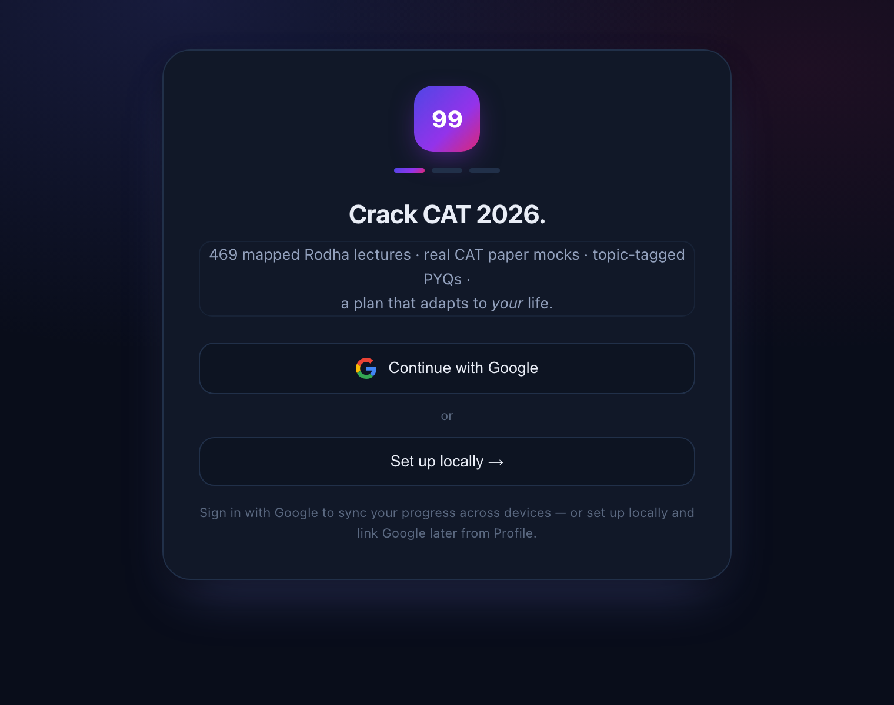

<div align="center">

# Percentile99 · CAT Prep OS

**A complete, self-adjusting CAT preparation platform — lectures, planner, real past-paper mocks, and progress analytics in one place.**

### 🔗 Live: **[percentile99.vercel.app](https://percentile99.vercel.app)**

No install, no signup wall — open the link, "Set up locally" to start in seconds, or "Continue with Google" to sync across devices.



</div>

---

## What it is

Percentile99 turns a scattered CAT prep stack (YouTube playlists, PDF papers, a spreadsheet tracker) into a single app that plans your days, serves real questions, and shows you exactly where you stand.

- **469 mapped Rodha lectures** (147.9 hours) organized into a study plan
- **787 real CAT past-paper questions** across **11 full papers** (2017, 2020, 2021, 2022 slots), every question topic-tagged
- **Full-paper mocks** rendered in an authentic CAT test interface
- **Cloud sync** via Google sign-in, or fully **local-only** if you prefer

## Features

### 🏠 Home — your dashboard
- Live **progress ring** and per-section bars (Quant / LRDI)
- **LeetCode-style activity heatmap** (26-week rolling window) with current and best **streaks**
- A **6-metric strip**: days to CAT, day streak, mocks taken, accuracy, questions solved, hours invested
- **"Test what you've studied"** — a smart button that auto-selects the topics you've covered and builds a targeted test
- Today's **plan queue** with one-tap watch links, mark-for-revision, and per-lecture notes

### 📚 Study — the planner
- Three planning modes: **Daily** (a lecture schedule for every date), **Weekly** (topics per week, you pick the days), or **Topic-wise** (the full ordered sheet, self-paced)
- Pace presets (Relaxed / Standard / Fast) that reshape the whole plan and project a finish date
- **Revision section** that surfaces your starred lectures and everything you've left a note on
- Every lecture links straight to the verified YouTube source

### 🎯 Practice — drills & custom tests
- **Timed topic drills** built from the 787-question, topic-tagged PYQ pool
- **Custom test builder** — pick any mix of QA / DILR / VARC topics
- **Smart auto-select** picks the topics you've actually studied so far

### 📝 Mocks — the real thing
- Full CAT papers in an **authentic exam interface**: section locks and timers, the question **palette**, an **on-screen calculator**, and **per-question analysis** afterward
- Timers use **wall-clock deltas** (accurate even when the tab is backgrounded) and **IST-correct** date logic — no late-night rollover bugs

### 👤 Profile & sync
- Edit your name / target exam / plan pace anytime
- **Google sign-in + Supabase cloud sync** to carry progress across devices, or stay **local-only** and link Google later
- Light / dark mode; responsive layout with a mobile bottom nav

## Tech & architecture

**Static frontend (Vercel) + Supabase (Postgres · Google OAuth · Row-Level Security).**

The entire app is a single `index.html` — vanilla HTML/CSS/JS, **no build step, no framework, no dependencies at runtime**. Data (lectures, plan, mocks) is embedded or loaded as JSON; Supabase handles auth and per-user sync with RLS so each user only sees their own rows.

## Repository layout

```
index.html               The entire app (single-file vanilla JS, no build step)
mocks.json               11 real CAT papers · 787 topic-tagged questions
vercel.json              Static hosting config
supabase/schema.sql      profiles, progress, stars, notes, attempts + RLS
docs/SETUP_GUIDE.md      Deploy to Vercel + wire up Supabase & Google OAuth
docs/INGEST_FRAMEWORK.md Spec for adding a new CAT paper
AGENTS.md · INGEST_NOTES.md  Agent guide + topic-tagging taxonomy for ingestion
tools/                   Ingestion + validation (detect · crop · validate · smoke_test)
pipeline/                Data provenance — scripts that built the app + question bank
```

## Run it yourself

Nothing to build — open `index.html` locally, or deploy the folder to any static host.

```bash
# local preview
python3 -m http.server 8000      # then open http://localhost:8000

# add a new CAT paper to mocks.json, then verify before committing:
npm run validate                 # schema + tags + figure paths
npm run smoke                    # headless app-load check
```

Full go-live steps (Vercel + Supabase + Google OAuth) are in **[docs/SETUP_GUIDE.md](docs/SETUP_GUIDE.md)**.

## Data notes

- Lecture names / durations / IDs are extracted from the official Rodha playlists and verified programmatically (July 2026).
- `mocks.json` contains actual CAT questions (IIM copyright) — fine for personal study; for a public product, keep mocks private/invite-only or swap in original content. The 24 `bank.json` drill questions are original.
- Every question carries a topic (`sub`) tag: QA is fine-grained, DILR is tagged per set, VARC by question type (see [INGEST_NOTES.md](INGEST_NOTES.md)). This powers the drill picker and smart-test auto-select.

## Roadmap

- [ ] Export / backup of local progress
- [ ] Re-baseline button for slipped schedules + rest-day support
- [ ] Ingest remaining papers (2018–2019 pending answer keys; 2005–2016 legacy formats)
